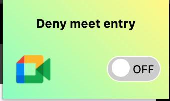

# Deny meet entry - Chrome Extension

A chrome extension that will automatically deny the entry request of any participant when enabled. You can disable it anytime.

## Demo (I know design sucks xD)

## Steps to Install
1. Clone this repository.
2. Navigate to chrome://extensions/
3. Toggle the developer mode (Activate it).
4. Click on 'Load Unpacked'
5. Select the complete folder which you cloned in the first step.

## Tech Stack
- HTML
- CSS
- JavaScript (VanillaJS)
